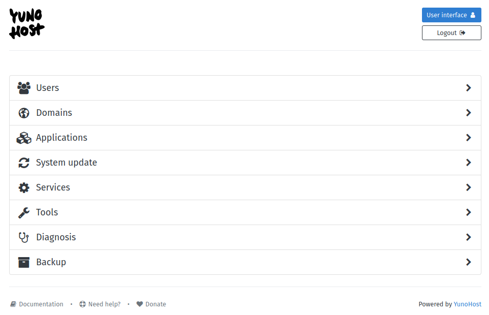

<h1 align="center">YunoHost Admin</h1>

<div align="center">
 

[](https://github.com/YunoHost/yunohost-admin/actions/workflows/eslint.yml)
[](https://github.com/YunoHost/yunohost-admin/blob/dev/LICENSE)

[YunoHost](https://yunohost.org) administration web interface (VueJS client for the API).

This client is a part of the YunoHost project, and can not be installed directly. Please visit the YunoHost website for [installation instructions](https://yunohost.org/install).



</div>

Issues
------

- [Please report issues on YunoHost bugtracker](https://github.com/YunoHost/issues).

Translation
-----------

You can help translate Yunohost-Admin on our [translation platform](https://translate.yunohost.org/engage/yunohost/?utm_source=widget)

<div align="center"></div>

Developpers
-------------

Contributions are welcome!

In order to contribute you will need to setup a development environment using [ynh-dev](https://github.com/YunoHost/ynh-dev) (see the README).
Once you have a environment running and are attached to it (with `./ynh-dev start`) you will be able to run:

```
$ ./ynh-dev use-git yunohost-admin
```

This command will install all dependencies and start a dev server (based on [webpack-dev-server](https://github.com/webpack/webpack-dev-server)) with Hot-Module-Replacement (live updates on code modification without reloading the page nor rebuilding the whole code). After the build step, click on the "Network:" link and you are good to go.

You can also install [Vue Devtools](https://addons.mozilla.org/fr/firefox/addon/vue-js-devtools/) (module for Firefox but also exists for Chromium/Chrome) if you want component trees, performance views and so on.

On a YunoHost instance, the web admin files are located at `/usr/share/yunohost/admin`.
